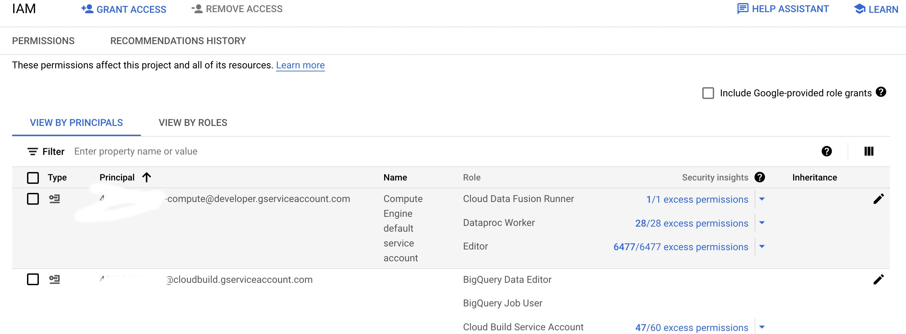

### This repo takes sample files from public sap bucket
 - To upload those file into your bucket 
```bash
PROJECT_ID=<project_id>
RAW_BUCKET=$PROJECT_ID-raw-sap-data-demo
# creating a bucket for raw data
gsutil mb -p $PROJECT_ID -l US gs://$RAW_BUCKET
gsutil cp -r gs://kittycorn-test-harness-us-central1/ecc/ gs://$RAW_BUCKET
```
#### Add the IAM role for a new service account 
###### <Project_number>.@cloudbuild.gserviceaccount.com

 - Then clone the repo 

 - Then run deploy.sh file.
 ``` bash 
 chmod +x deploy.sh
 ./deploy.sh
```

 - You data will be ready into BiqQuery

### Now its time to make the test 
 - Test part will be done on adr6 file
 ```bash 
  chmod +x adr6_test.sh
 ./adr6_test.sh
 ```
   - This will create copy of adr6 into your bucket
   - Then it will make some change into that file for client 050 and Put tag D in operation flag column
   - It will upload the file into a new table
   - You will see following Row has been deleted from the CDC table
 

